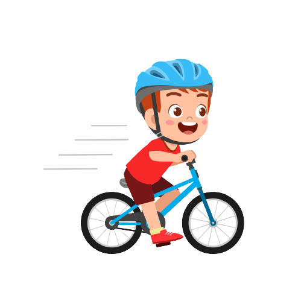

<div align="center">
  <a href="https://github.com/ZulfiqarG/bike-partner">
    
  </a>

<a href="https://github.com/ZulfiqarG/bike-partner">
    
  </a>

  <p align="center">
  <br/>
    Bike Buddy ensures that your child's cycling adventures are as safe as can be, giving you the ultimate peace of mind. With its cutting-edge route and mapping optimisation technology, you can trust that your little ones are always cycling on the safest roads available. Give yourself the gift of worry-free afternoons and let Bike Buddy be your go-to companion for all things cycling-related.
    <br/>
    <br/>
    Bike Buddy is proudly built by: Zulfiqar Shaikh
    <br />
    <br/>
    <a href="https://github.com/ZulfiqarG/bike-partner"><strong>Explore the docs »</strong></a>
    <br />
    <br />
    <a href="https://bike-partner.vercel.app/">View Live Website</a>
    ·
    <a href="https://github.com/ZulfiqarG/bike-partner/issues">Report Bug</a>
    ·
    <a href="https://github.com/ZulfiqarG/bike-partner/issues">Request Feature</a>
  </p>
</div>

### User Story

```
AS a concerned parent,
I WANT to easily plot the safest and most efficient cycling routes for my children,
SO THAT I can have peace of mind while they are cycling on the road
```

<p align="right"><a href="#readme-top">back to top</a></p>

### Description

Bike Buddy is the ultimate tool for parents and guardians looking to keep their children safe while cycling. With its interactive map, families can easily search for a location and plot a safe route. This takes into account various factors such as live traffic levels, available bicycle lanes, and lowest elevation to ensure the most efficient and safest route possible for children on the roads.

But Bike Buddy doesn't stop there - it also provides real-time updates on air quality, weather conditions, traffic-flow and traffic incidents, so users can stay informed and prepared for their ride. Users have the ability to view their current location and with Bike Buddy, families can confidently enjoy biking together on the safest roads available.

Say goodbye to repetitive tutorials - our modals tutorial for using the map automatically saves your progress to localStorage, ensuring that you never have to complete it again.

### APIs

Bike Buddy is powered by four main APIs - TomTom Routing, TomTom Reverse Geocoding, OpenWeatherMap, and AQI (Air Quality Index) - to deliver top-notch information and optimised routes to its users. In addition to these APIs, Bike Buddy also utilises the Leaflet.js library, the Jawg Maps Tile API & MapQuest Tile API to provide an interactive and visually appealing map experience. These technologies ensure cycling safety and convenience.

### Design

The design of this app was intended to be child-friendly whilst also appealing to adults & parents. So for the colour scheme a sky blue was chosen as the primary, this colour is friendly yet not too corporate, it's easy on the eyes and still appealing to children. For the vector images we chose to show a family cycling together to solidify to the user what this app is based around. The logo was modified to ensure the letters have a slightly fun and quirky feel to them.

Users are initially greeted with a landing page to give a brief description of what Bike Buddy actually is. From there they go straight to the map dashboard screen. Because the user may not be familiar with our app and because it has some different features to traditional navigation maps we include a modal tutorial to guide the user through our main features.

Because this is a family based-app we wanted to include numerous features to help with the safety of the user. So it was decided that enxt to the map would be various buttons the user could explore to find out information such as traffic flow/ nearby traffic incidents, the air quality of the area. Not to mention general biking safety tips that display at the bottom of the screen.

Overall the app was intended to be simple and straight forward to use for people of all ages, which is why after the landing screen all features are neatly together on the app dashboard, the user isn't even required to input a starting and end address and can simply tap their way to the desination directly on the map.

The app started out as a rough black and white wireframe and transitioned to a fullscale figma prototype where most of the functionality and animations were fleshed out. Link Here: https://www.figma.com/proto/LtBwPWntoCXayy5pIhgsC1/BikeBuddy-(Copy)?scaling=min-zoom&page-id=0%3A1&node-id=1%3A4&starting-point-node-id=1%3A4

### Future Development

Bike Buddy is always looking for ways to improve and enhance the cycling experience for families. We have some exciting ideas that will take Bike Buddy to the next level. With the ability to download routes as a file and see the duration and distance of a chosen route, users can easily track and plan their rides. And with Strava's API integration, users would be able to see their performance statistics and track their progress within Bike Buddy.

Furthermore, a feature where routes are based on the user's past rides and performance on Strava, challenging them to improve their cycling skills and try new routes. Plus, a leaderboard which would allow users to compare their stats with their friends or other Bike Buddy users, adding a fun element of competition. And for added peace of mind, a Bike Buddy safety rating for each generated route.